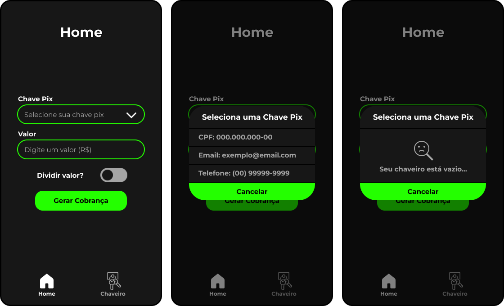
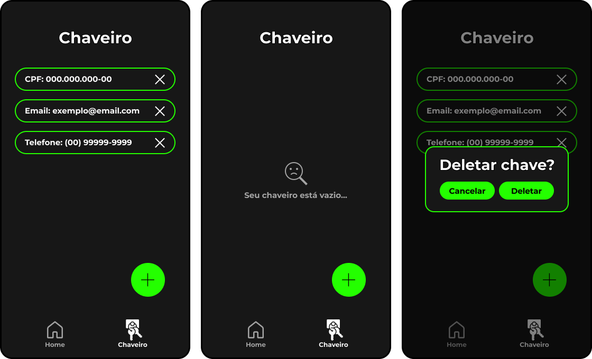
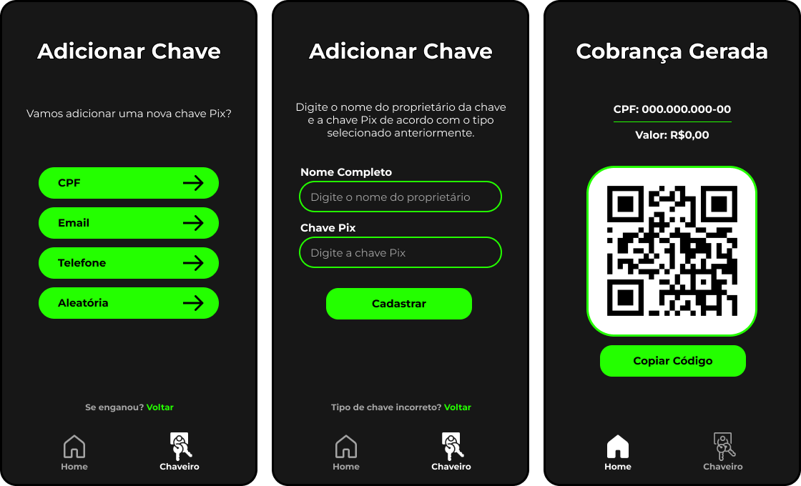

# Payload-Generator-Application | Welcome to my repository ✌

In this repository I made a <b>Payload Generator Application</b> developed for my capstone project as a computer technician at the Federal Institute of Paraná (IFPR). The project is named "<b>Development of an Application for Generating Pix Payloads:</b> the support of technology in payment methods".

For the development of this application, many tools were used. The prototypes were created using Figma. The programming language chosen was React Native (JavaScript framework), along with Expo (React Native framework). And the selected database was SQLite.

<h3 align="center">Interfaces</h3>

 

 

<h3 align="center">Capstone Project</h3>

In my capstone project, beside the development of the application,  I talk about the advances in purchasing processes from the commercial revolution, technologies that contributed to payment methods and I made a comparative analysis of financial applications that have Pix functionalities with my application. Below is the abstract of my capstone project for anyone interested.

<h3 align="center">Abstract</h3>

Given that the generation of Pix payloads, which should be done efficiently, often takes longer than it should due to the lack of focus in financial institution applications, this work aims to make the process of Pix payload generation more efficient through the development of a dedicated application for this purpose. To achieve this, literature research was conducted on the creation of mobile applications, advancements in purchasing processes driven by the commercial revolution, and technologies that have contributed to payment methods. In addition, mobile applications from financial institutions were selected for comparison with the proposed system. This revealed the need to offer a product dedicated solely to Pix payload generation, providing users with greater convenience, speed, and efficiency for charging and payments. To outline the steps that should be followed for the development of the proposed system, functional and non-functional software requirements were identified, a use case diagram was developed, and a medium-fidelity prototype was created. To achieve the goal of generating Pix payloads, it was not possible to use the Pix API, as it was made available only to financial institutions such as banks, fintechs, and other authorized entities. As a result, recourse was made to a document issued by the Central Bank of Brazil and an existing Python module, which together resulted in the adopted solution.

<b>Keywords:</b> application; payment methods; Pix payload; Pix; technology.

  
  
  

##
### Connect with me:

